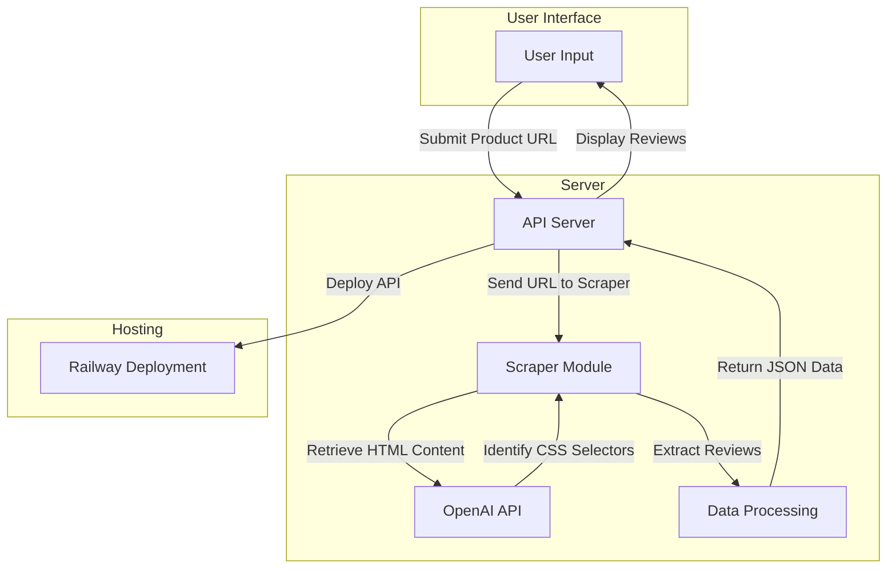

# GoMarble Review Scraper Project

## Introduction

This project is an API server designed to extract reviews from product pages. It leverages OpenAI's Large Language Models (LLMs) to dynamically identify CSS selectors for reviews and uses Selenium for automated browser interactions to handle pagination and collect all reviews. The API supports platforms such as Shopify and Amazon.

## System Workflow

The workflow for the project is illustrated below:



### Components:

1. **User Input**
   - Users submit the URL of a product page to retrieve reviews.

2. **API Server**
   - Manages incoming requests and communicates with the scraper module.

3. **Scraper Module**
   - Utilizes Selenium for automated scraping and OpenAI for CSS selector identification.

4. **OpenAI API**
   - Dynamically identifies relevant CSS selectors from the HTML content.

5. **Data Processing**
   - Compiles the extracted reviews into JSON format.

6. **Hosting**
   - The API is deployed on Railway for public access.

---

## Key Features

- **Dynamic CSS Selector Detection**: Uses OpenAI's API to dynamically pinpoint CSS selectors for review elements.
- **Automated Scraping**: Employs Selenium for headless browser automation.
- **Pagination Support**: Automatically navigates through multiple review pages (limited to 10 pages for efficiency, adjustable as needed).
- **Cross-Platform Compatibility**: Adapts to various review pages across different platforms.
- **Live Deployment**: Accessible through a Railway-hosted endpoint.

---

## API Details

### `GET /api/reviews?page={url}`

- **Query Parameter**:  
    `page` (required) – The URL of the product page to scrape.

- **Response Format:**

    ```json
    {
        "reviews_count": 100,
        "reviews": [
            {
                "title": "Review Title",
                "body": "Content of the review",
                "rating": 5,
                "reviewer": "Reviewer Name"
            }
        ]
    }
    ```

---

## Requirements

- **Python 3.10 or higher**
- **Google Chrome** and **ChromeDriver**
- **OpenAI API Key** (stored in a `.env` file)

---

## Installation Guide

1. **Clone the Repository**
    ```
    git clone https://github.com/gomarble.git
    cd gomarble
    ```

2. **Install Dependencies**
    ```
    pip install --no-cache-dir -r requirements.txt
    ```

3. **Configure Environment Variables**
    - Create a `.env` file in the project root:

        ```env
        OPENAI_API_KEY="your_openai_api_key"
        ```

    - Replace `your_openai_api_key` with your actual API key from OpenAI.

4. **Start the Server**
    ```
    python app.py
    ```

5. **Access the API**
    - The API will be available at `http://localhost:8080`.

---

## Deployment Information

The API is deployed on Railway and can be accessed at:

https://gomarble-production.up.railway.app/

---

## Contact Information

For any inquiries or feedback, feel free to reach out via email at anshusuresh03@gmail.com.

