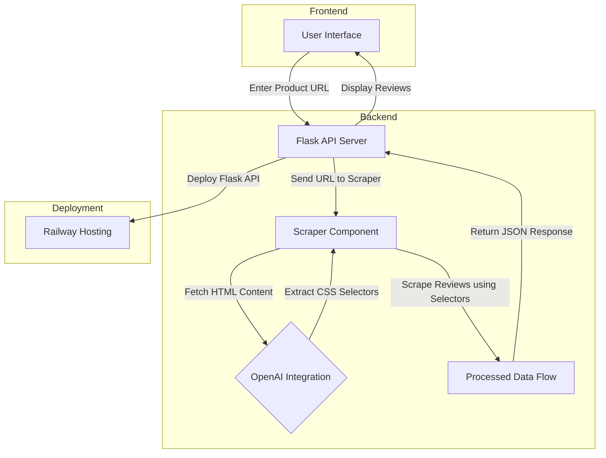

# GoMarble Review Scraper Assignment

## Overview

This project is an API server designed to extract review information from product pages. It utilizes OpenAI's Large Language Models (LLMs) to dynamically determine CSS selectors for reviews and employs Selenium for browser automation to handle pagination and retrieve all reviews. The API is compatible with platforms like Shopify and Amazon.

## System Architecture

The following diagram illustrates the project's workflow:



### Description:

1. **User Interface (Frontend)**
   - Users input a product page URL to retrieve reviews.

2. **Flask API Server (Backend)**
   - Manages API requests and forwards them to the scraper.

3. **Scraper Component (Selenium)**
   - Uses browser automation to extract review data from product pages.

4. **OpenAI Integration**
   - Dynamically identifies review-related CSS selectors from HTML content.

5. **Processed Data Flow**
   - Returns the extracted review data in JSON format.

6. **Deployment (Railway Hosting)**
   - The API server is hosted online for public access.

---

## Features

- **Dynamic CSS Selector Identification**: Leverages OpenAI's API to dynamically determine the CSS selectors for review elements.
- **Browser Automation**: Utilizes Selenium for headless browser scraping.
- **Pagination Handling**: Automatically processes paginated reviews (limited to 10 pages to ensure quick execution, but this can be adjusted).
- **Universal Compatibility**: Adapts dynamically to work with various review pages.
- **Deployed API**: Hosted on Railway for easy public access.

---

## API Endpoint

### `GET /api/reviews?page={url}`

- **Parameters**:  
    `page` (required) – The URL of the product page to scrape reviews from.

- **Response Format:**

    ```json
    {
        "reviews_count": 100,
        "reviews": [
            {
                "title": "Review Title",
                "body": "Review body text",
                "rating": 5,
                "reviewer": "Reviewer Name"
            }
        ]
    }
    ```

---

## Prerequisites

- **Python 3.10+**
- **Google Chrome** and **ChromeDriver**
- **OpenAI API Key** (stored in `.env` file)

---

## Installation and Setup

1. **Clone the Repository**
    ```
    git clone https://github.com/gomarble-review-scraper.git
    cd gomarble-review-scraper
    ```

2. **Install Dependencies**
    ```
    pip install --no-cache-dir -r requirements.txt
    ```

3. **Set Up the Environment**
    - Create a `.env` file in the root directory:

        ```env
        OPENAI_API_KEY="your_openai_api_key"
        ```

    - Replace `your_openai_api_key` with your actual OpenAI API key.

4. **Run the Server**
    ```
    python app.py
    ```

5. **Access the API**
    - The API will be available at `http://localhost:8080`.

---

## Deployment

The API is hosted on Railway and can be accessed via the following live URL:

https://gomarble-test-production.up.railway.app/

---

## Contact

For any questions or feedback, please contact me at anshusuresh03@gmail.com.

